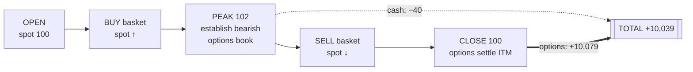
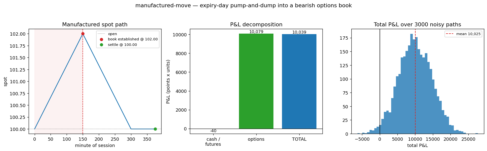
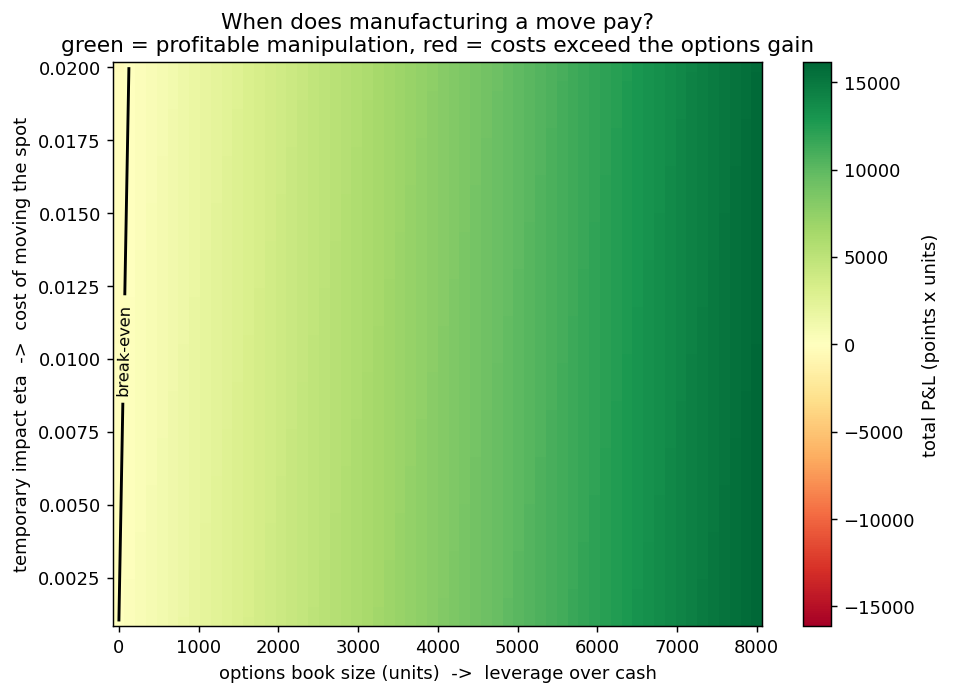

# manufactured-move

A simulation of the expiry-day options strategy at the centre of SEBI's 2024–25 case
against Jane Street in Indian index derivatives: **move the spot in the (smaller)
cash/futures market so that a (much larger) options book, established at the manufactured
peak, settles in the money.**

> Research / educational simulation of a *documented, alleged* strategy. It is a sandbox for
> studying cross-market impact and how such a pattern would be detected — not a tool for, or
> a guide to, trading. Executing this in live markets is market manipulation and illegal.

**New here? Read [`docs/HOW_IT_WORKS.md`](docs/HOW_IT_WORKS.md)** — a plain-English walkthrough
of the strategy, the model, and how to read the results (no quant background assumed).

---

## The mechanism

Two linked markets trade the same index on expiry day:

- **Cash / futures** (index constituents + futures): moderate liquidity. Trading here
  *moves the spot*, but that costs impact.
- **Options**: far larger, leveraged notional, priced *off* that same spot. Here the
  manipulator is a price-taker — huge size can be held without moving option prices.

The play (intraday variant):

1. **Accumulate (AM):** buy the basket → permanent impact **pumps the spot up**.
2. At the manufactured peak, **establish a large bearish options book** (short calls /
   long puts) — premiums are marked to the inflated spot.
3. **Distribute (PM):** sell the basket back down → the spot falls (and, if you carry a
   net short into the close, the *settlement* print is dragged below the open — "marking
   the close").
4. The bearish book **settles in the money**. The cash leg's round-trip loss is small
   because the options size dwarfs the cash quantity used to move the market.



**Why it works, in one line:**

```
profit  ≈  N_options · |ΔS_manufactured|  −  impact_cost(N_cash, η)  −  theta/vega_bleed
```

The whole project is about characterising — and then *optimising* — that inequality.

## The model

Spot follows a discrete **Almgren–Chriss** impact process; a signed cash trade `q[t]`
(>0 = buy) has permanent impact on the mid and temporary impact on its own fill:

```
S[t+1]  = S[t] + γ·q[t] + σ_step·Z[t]      # permanent impact + diffusion
exec[t] = S[t] + η·q[t]                     # temporary impact (you cross the spread)
```

Options are marked by **Black–Scholes** off `S[t]`, settling at intrinsic value at the
close (`τ → 0`). The manipulator holds arbitrary option size with no price impact — that
asymmetry (can move the spot, can't move option prices) is the entire edge.

| symbol | meaning | default |
|--------|---------|---------|
| `γ` | permanent impact (spot points per unit traded) | `0.002` |
| `η` | temporary impact (slippage per unit per step) | `0.004` |
| `σ` | annualised vol (path **and** BS marks) | `0.20` |
| `N_cash` | units bought/sold to move the spot | `1000` |
| `N_options` | size per leg of the bearish book | `5000` |

## Result (baseline, deterministic)

`python scripts/run_baseline.py` reproduces the SEBI signature — **small loss in cash,
large win in options:**

```
manufactured move   2.00   (pump 100 → 102, dump back to 100)
leverage ratio      5.0x   (options units / cash units)
--------------------------------------------
cash / futures leg     -40.0
options leg         +10,078.9
TOTAL P&L           +10,038.9      → 251x return on the cost of moving the spot
--------------------------------------------
Monte Carlo (3000 noisy paths): mean +10,025, P(profit) 98.5%
```



`python scripts/sweep.py` traces the **break-even surface** over (options size) × (impact).
The finding: it is profitable across almost the *entire* realistic parameter space — the
economics alone barely deter it. What actually binds is **risk, position limits, and
detection** — which is exactly what the later phases add.



## Layout

```
src/mmove/
  black_scholes.py   BS price + Greeks, τ→0 settlement
  market.py          MarketParams, Almgren–Chriss spot dynamics
  options.py         OptionsBook (legs marked to spot), bearish-book constructors
  strategy.py        hand-coded pump-and-dump schedule
  simulator.py       run a path → P&L decomposition (+ Monte Carlo)
  analysis.py        2-D parameter sweeps (break-even surface)
scripts/
  run_baseline.py    the P0 demo above
  sweep.py           the break-even heatmap
tests/               put-call parity, settlement, simulation invariants
config/default.yaml  the baseline scenario
```

## Run it

```bash
cd manufactured-move
python scripts/run_baseline.py     # decomposition + reports/baseline.png
python scripts/sweep.py            # reports/breakeven.png
pytest                             # invariants
```

No install needed — the scripts add `src/` to the path. (Or `pip install -e .`.)

## Scaling to BANKNIFTY

Spot is normalised to `100` for transparency. To read the P&L in rupees, multiply by the
point-value of your exposure: for a BANKNIFTY level `L` and lot size `M`, one "unit" here
≈ one lot, and P&L in ₹ ≈ `pnl × (L/100) × M`. The `γ, η` coefficients should be
recalibrated to real depth (e.g. from impact regressions on constituent order books).

## Roadmap

- [x] **P0 — Core simulator:** BS + Almgren–Chriss, hand-coded pump-and-dump, P&L split.
- [x] **P1 — Sensitivity:** break-even surface over size / impact.
- [ ] **P2 — Optimal strategy:** solve for the optimal cash trajectory + book size as an
      *inverted* Almgren–Chriss control problem (LQ closed form for intuition; DP on a
      spot × inventory × time grid for the option strike kink), with risk / position-limit
      / detection penalties that produce an interior optimum.
- [ ] **P3 — Agent-based LOB (stretch):** market-maker + noise agents; an RL agent that
      *rediscovers* the pattern; a SEBI-style surveillance signal (own aggressive flow vs.
      adverse index moves) to flag it.
- [ ] **P4 — Dashboard:** Streamlit sliders over the parameters, live path + P&L.

## References

Modelled on the mechanism described in SEBI's interim/final orders in the Jane Street
matter (2024–25). Impact model: Almgren & Chriss, *Optimal execution of portfolio
transactions* (2001).
