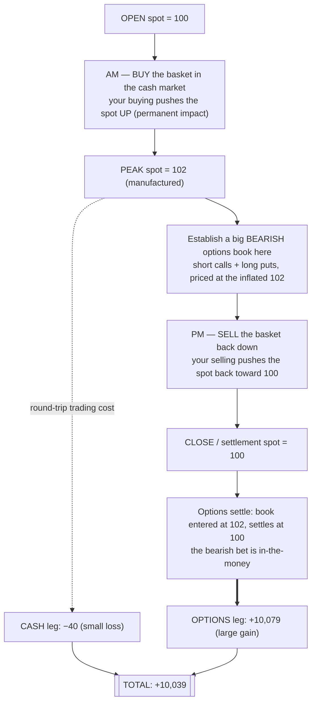

# How `manufactured-move` works

A plain-English walkthrough of the whole project — what the strategy is, why it makes
money, how the simulation models it, and how to read the results. No prior quant knowledge
assumed; the math is introduced gently as it comes up.

> This is a **research simulation** of a *documented, alleged* strategy (SEBI's case against
> Jane Street in Indian index options, 2024–25). It exists to understand the mechanism and
> how it would be detected. Doing this in a live market is illegal manipulation.

---

## 1. The story in one paragraph

On the day index options expire, there are two markets trading the *same* underlying index.
One is comparatively small (the **cash/futures** market — the actual stocks and index
futures). The other is huge (the **options** market). Crucially, option prices are tied to
the index level. So a trader with deep pockets can **spend a little in the small market to
push the index around**, and **collect a lot in the big market** where they hold a bet that
pays off from that same push. You take a small, deliberate loss moving the market, and
monetise it many times over in the market that's too big to move directly. That's the trade.

---

## 2. Two markets, one price

Everything rests on three facts:

1. **The index level ("spot") is set by trading the cash/futures market.** If you buy a lot
   of the constituent stocks (or index futures), you push the index *up*. If you sell, you
   push it *down*. This is **market impact** — trading moves prices.

2. **Options are priced off that same spot.** A *call* option profits when the index rises;
   a *put* profits when it falls. Their fair values are a known function of the spot (the
   Black–Scholes formula). Move the spot, and every option reprices instantly.

3. **The two markets are wildly different sizes.** The options market carries far more
   notional than the cash/futures market. So you can hold an enormous options position, but
   you can only move the *spot* by trading the smaller cash market — and that costs you.

The asymmetry in fact #3 is the entire edge: **you can move the spot, but you can't move
option prices by trading options.** So you separate *where you move the market* (small cash
market) from *where you place the bet* (huge options market).

---

## 3. The trade, step by step



This is exactly the left panel of [`baseline.png`](img/baseline.png): the spot ramps up to a
manufactured peak, the bearish book is established at the top (red dot), then the spot is
walked back down to settle (green dot).

---

## 4. Why the options side wins

At the peak, the trader sells **calls** (which look expensive because the index is inflated)
and buys **puts** (which look cheap for the same reason). Both are bets that the index will
fall. Then the trader *makes* the index fall by selling off the basket they bought.

- The **short calls** expire worthless → the trader keeps the rich premium.
- The **long puts** finish in-the-money → they gain as the index drops.

The size of that gain is roughly:

```
options gain  ≈  (options position size)  ×  (how far the index was walked down)
```

The **cost** of walking the index down (and up in the first place) is roughly:

```
cash cost  ≈  (temporary impact) × (how much you traded)²   — a small, bounded number
```

Because the options position is many times larger than the cash position, the first number
dwarfs the second. That's the whole game in two lines.

---

## 5. The model, piece by piece

The simulation is deliberately minimal — just enough to make the mechanism quantitative.

### 5a. Moving the spot — the impact model (`market.py`)

We use the standard **Almgren–Chriss** model of market impact. A signed trade `q` (positive
= buy, negative = sell) affects the spot two ways:

```
S[t+1] = S[t] + γ·q[t] + σ·noise      ← PERMANENT impact: the push that stays
exec[t] = S[t] + η·q[t]               ← TEMPORARY impact: extra slippage on your own fill
```

- **`γ` (gamma) — permanent impact.** Buying nudges the mid price up and it *stays* up. This
  is what lets you manufacture a move: buy in the morning to lift the spot, sell in the
  afternoon to drop it back. Round-trip, the permanent pushes cancel (you end where you
  started) — unless you deliberately end net short, which drags the *closing* price down
  ("marking the close").
- **`η` (eta) — temporary impact.** Every time you trade you pay a little extra (you "cross
  the spread"). This is the cost of the whole exercise. It doesn't stay in the price — it's
  just a toll you pay on each trade.
- **`σ` (sigma) — volatility.** Random noise in the price, so paths aren't perfectly clean.

### 5b. Pricing the options — Black–Scholes (`black_scholes.py`)

Given the spot, an option's fair value comes from the **Black–Scholes** formula. Two things
matter for us:

- Option value is a smooth function of the spot **before** expiry.
- **At** expiry (settlement) it collapses to **intrinsic value**: a call is worth
  `max(spot − strike, 0)`, a put is worth `max(strike − spot, 0)`. In the code this is the
  `τ → 0` case.

Key modelling assumption: **the options market is a price-taker.** Option marks follow the
spot via Black–Scholes, and the manipulator can hold *any* size without moving option prices.
Only cash-market trades move the spot. (This is the fact #3 asymmetry, encoded.)

### 5c. Adding it up — the P&L decomposition (`simulator.py`)

At the end of the day we split the profit into its two legs:

- **Cash / futures leg** = money from all the basket trades + whatever inventory is left,
  marked at the close. For a clean round-trip (end flat) this is a small *loss* — the cost of
  moving the market.
- **Options leg** = (value of the book at settlement) − (value when it was established at the
  peak). This is the large *gain*.

`total = cash + options`. We also report a **counterfactual**: the same options book with *no*
manufactured move. It's ~0 — confirming that essentially the entire options profit comes from
the manufactured move, not from just being directionally short.

---

## 6. Reading the numbers

Running `python scripts/run_baseline.py` prints:

```
manufactured move   2.00      the spot was walked from 102 (entry) down to 100 (settle)
leverage ratio      5.0x       options position is 5× the cash position used to move the spot
-------------------------------------------------
cash / futures leg     -40.0   ← the toll for moving the market (small)
options leg         +10,078.9  ← the bearish book paying off (large)
TOTAL P&L           +10,038.9  ← net profit
-------------------------------------------------
Monte Carlo: mean +10,025, P(profit) 98.5%   ← still works once you add random noise
```

How to read it:

- **The cash leg loses only ~40.** You bought on the way up and sold on the way down around
  your own price hump, plus the temporary-impact toll — a small, bounded cost.
- **The options leg makes ~10,079** ≈ `5000 units × 2.0 points` of manufactured move. This is
  the payoff.
- **Net +10,039 is ~250× the cost** of moving the market. That extreme ratio is the point.
- **The Monte Carlo run** repeats it over 3,000 random paths. The edge survives noise: it's
  profitable ~98.5% of the time. (Right panel of `baseline.png`.)

---

## 7. Reading the break-even map

`python scripts/sweep.py` produces [`breakeven.png`](img/breakeven.png): total profit coloured
across two axes — **options size** (horizontal, i.e. how much leverage you have over the cash
market) and **temporary impact `η`** (vertical, i.e. how expensive it is to move the spot).

The striking result: it's **green (profitable) almost everywhere.** The break-even line sits
at a *tiny* options size, and making the market more expensive to move (higher `η`) barely
matters. In other words, the raw economics almost never stop you.

So what *does* stop a real manipulator? Not the P&L math — it's **risk** (the move might not
happen), **position limits**, and **detection** by the exchange/regulator. That's precisely
what the next phase of the project adds, and why it's the interesting part.

---

## 8. "Isn't this just shorting the index?"

Fair question — the baseline book behaves like a synthetic short. Two things make it genuine
cross-market *manipulation*, not an ordinary directional bet:

1. **You create the move you profit from.** A normal short hopes the market falls. Here you
   *make* it fall by trading the basket. The options profit is manufactured, not forecast —
   the counterfactual in §5c is ~0.
2. **The leverage comes from the market-size asymmetry.** You express the bet in the options
   market (which you can't move and where you can hold huge size) while paying to move the
   *spot* in the much smaller cash market. Building the same directional exposure by shorting
   futures directly would move the very price you're betting on, against you.

---

## 9. The code, file by file

| file | concept it implements |
|------|-----------------------|
| [`src/mmove/black_scholes.py`](../src/mmove/black_scholes.py) | option pricing + Greeks; settlement (`τ→0`) = intrinsic value |
| [`src/mmove/market.py`](../src/mmove/market.py) | market parameters + Almgren–Chriss spot dynamics (§5a) |
| [`src/mmove/options.py`](../src/mmove/options.py) | the options book (legs marked to spot) + bearish-book builders |
| [`src/mmove/strategy.py`](../src/mmove/strategy.py) | the hand-coded pump-and-dump schedule (§3) |
| [`src/mmove/simulator.py`](../src/mmove/simulator.py) | runs a day, produces the P&L decomposition (§5c) + Monte Carlo |
| [`src/mmove/analysis.py`](../src/mmove/analysis.py) | 2-D parameter sweeps → the break-even map (§7) |
| [`scripts/run_baseline.py`](../scripts/run_baseline.py) | the headline demo + `baseline.png` |
| [`scripts/sweep.py`](../scripts/sweep.py) | the break-even heatmap + `breakeven.png` |

To follow the logic end-to-end, read in this order: `market.py` → `options.py` →
`strategy.py` → `simulator.py`. Each is short and commented.

---

## 10. What the model simplifies (so you trust it appropriately)

This is a **minimal sandbox**, not an exchange simulator. Known simplifications:

- **Linear impact.** Real impact is closer to square-root and has decay; here it's linear and
  the temporary part fully reverts each step.
- **Options carry no impact.** Reasonable as a first cut, but in reality huge option flow does
  move implied vol and prices.
- **Settlement = the last mid.** Real Indian settlement is a VWAP over the final window; the
  "marking the close" variant (`end_short_units`) approximates it but doesn't model the window.
- **One manipulator, no competition.** No other market makers or arbitrageurs push back.
- **No fees, taxes (STT), or borrow costs.** These would shave the edge but not remove it.
- **Fixed volatility.** Same `σ` for the path and the option marks; no vol smile.

None of these change the qualitative result; they'd change the exact rupee numbers. Fixing
them is future work (see the roadmap in the README).

---

## 11. What's next — finding the *optimal* strategy

The baseline uses a *hand-coded* pump-and-dump. The next phase asks: what's the **best
possible** version? Formally it's an *inverted* Almgren–Chriss control problem — choose the
whole buying/selling trajectory *and* the options size to maximise expected total profit,
now **minus** penalties for risk, position limits, and detection (which is what creates a
sensible, finite "optimal" instead of "trade infinitely large"). We'll solve it two ways —
a clean closed-form approximation for intuition, and a numerical grid solver for the exact
kinked option payoff — and later let a reinforcement-learning agent try to *rediscover* the
strategy from scratch. See the roadmap in [`README.md`](../README.md).
